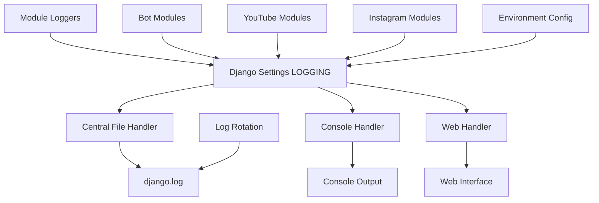

# Дизайн системы централизованного логирования

## Обзор

Система централизованного логирования объединит все логи проекта в единый файл `django.log` с поддержкой консольного вывода и веб-интерфейса. Дизайн основан на расширении существующей конфигурации Django LOGGING и миграции всех модулей на единую систему.

## Архитектура

### Компоненты системы



### Уровни логирования

1. **CRITICAL** - Критические ошибки системы
2. **ERROR** - Ошибки выполнения
3. **WARNING** - Предупреждения
4. **INFO** - Информационные сообщения
5. **DEBUG** - Отладочная информация

## Компоненты и интерфейсы

### 1. Центральная конфигурация логирования

**Файл:** `instagram_uploader/settings.py`

Расширение существующей конфигурации LOGGING:

```python
LOGGING = {
    'version': 1,
    'disable_existing_loggers': False,
    'formatters': {
        'verbose': {
            'format': '[{asctime}] {levelname} {name} {message}',
            'style': '{',
        },
        'simple': {
            'format': '{levelname} {message}',
            'style': '{',
        },
    },
    'handlers': {
        'console': {
            'class': 'logging.StreamHandler',
            'formatter': 'verbose',
            'level': os.getenv('CONSOLE_LOG_LEVEL', 'INFO'),
            'filters': ['mask_secrets', 'truncate_long', 'deduplicate'],
        },
        'file': {
            'class': 'logging.handlers.RotatingFileHandler',
            'filename': os.path.join(BASE_DIR, 'django.log'),
            'formatter': 'verbose',
            'level': 'DEBUG',
            'maxBytes': int(os.getenv('LOG_MAX_BYTES', '50000000')),  # 50MB
            'backupCount': int(os.getenv('LOG_BACKUP_COUNT', '5')),
            'filters': ['mask_secrets', 'truncate_long'],
        },
        'web': {
            'class': 'uploader.logging_handlers.WebLogHandler',
            'formatter': 'verbose',
            'level': os.getenv('WEB_LOG_LEVEL', 'INFO'),
            'filters': ['mask_secrets', 'truncate_long'],
        },
        'null': {
            'class': 'logging.NullHandler',
        },
    },
    'root': {
        'handlers': ['console', 'file', 'web'],
        'level': 'DEBUG',
    },
    'loggers': {
        # Все существующие логгеры наследуют от root
        'django': {
            'level': 'INFO',
            'propagate': True,
        },
        'uploader': {
            'level': 'DEBUG',
            'propagate': True,
        },
        'bot': {
            'level': 'INFO',
            'propagate': True,
        },
        'youtube': {
            'level': 'INFO',
            'propagate': True,
        },
        'instagrapi': {
            'level': os.getenv('INSTAGRAPI_LOG_LEVEL', 'DEBUG'),
            'propagate': True,
        },
    },
}
```

### 2. Веб-обработчик логов

**Файл:** `uploader/logging_handlers.py` (новый)

```python
import logging
from django.core.cache import cache
from django.utils import timezone

class WebLogHandler(logging.Handler):
    """Обработчик для отправки логов в веб-интерфейс через cache"""
    
    def __init__(self, max_logs=1000, cache_timeout=3600):
        super().__init__()
        self.max_logs = max_logs
        self.cache_timeout = cache_timeout
    
    def emit(self, record):
        try:
            log_entry = {
                'timestamp': timezone.now().isoformat(),
                'level': record.levelname,
                'logger': record.name,
                'message': self.format(record),
                'module': getattr(record, 'module', ''),
            }
            
            # Сохраняем в общий кеш логов
            cache_key = 'system_logs'
            logs = cache.get(cache_key, [])
            logs.append(log_entry)
            
            # Ограничиваем количество логов
            if len(logs) > self.max_logs:
                logs = logs[-self.max_logs:]
            
            cache.set(cache_key, logs, self.cache_timeout)
            
        except Exception:
            self.handleError(record)
```

### 3. Миграция существующих модулей

#### Bot модули
- Обновить `bot/src/logger.py` для использования Django логгера
- Удалить отдельные FileHandler'ы
- Перенаправить все логи в центральную систему

#### YouTube модули
- Обновить `AsyncYTLogger` для использования Django логгера
- Удалить создание отдельных файлов в `uploader/yt_logs/`
- Интегрировать с центральной системой

#### Instagram модули
- Обновить все сервисы в `instgrapi_func/services/`
- Унифицировать логгеры типа `log = logging.getLogger('insta.auth')`

### 4. Утилиты для работы с логами

**Файл:** `uploader/logging_utils.py` (расширение)

```python
import logging
import os
from django.conf import settings

def get_centralized_logger(name: str) -> logging.Logger:
    """Получить централизованный логгер для модуля"""
    return logging.getLogger(name)

def setup_module_logging(module_name: str, level: str = None):
    """Настроить логирование для модуля"""
    logger = logging.getLogger(module_name)
    if level:
        logger.setLevel(getattr(logging, level.upper(), logging.INFO))
    return logger

def cleanup_legacy_logs():
    """Очистить старые файлы логов"""
    legacy_files = [
        'server.log',
        'instagram_upload.log',
        'bio_manager.log',
        'dolphin_api.log',
    ]
    
    for filename in legacy_files:
        filepath = os.path.join(settings.BASE_DIR, filename)
        if os.path.exists(filepath):
            try:
                os.remove(filepath)
                logging.info(f"Removed legacy log file: {filename}")
            except Exception as e:
                logging.warning(f"Could not remove {filename}: {e}")
    
    # Очистить директорию yt_logs
    yt_logs_dir = os.path.join(settings.BASE_DIR, 'uploader', 'yt_logs')
    if os.path.exists(yt_logs_dir):
        try:
            import shutil
            shutil.rmtree(yt_logs_dir)
            logging.info("Removed yt_logs directory")
        except Exception as e:
            logging.warning(f"Could not remove yt_logs directory: {e}")
```

## Модели данных

### Конфигурация через переменные окружения

```bash
# Уровни логирования
CONSOLE_LOG_LEVEL=INFO
WEB_LOG_LEVEL=INFO
INSTAGRAPI_LOG_LEVEL=DEBUG
BULK_LOG_LEVEL=INFO
REQUEST_LOG_LEVEL=INFO

# Ротация логов
LOG_MAX_BYTES=50000000  # 50MB
LOG_BACKUP_COUNT=5      # Количество архивных файлов

# Веб-логи
WEB_LOG_CACHE_TIMEOUT=3600  # 1 час
WEB_LOG_MAX_ENTRIES=1000    # Максимум записей в кеше
```

### Структура лог-записи

```python
{
    'timestamp': '2025-01-21T10:30:00Z',
    'level': 'INFO',
    'logger': 'uploader.views',
    'message': '[BULK UPLOAD] Task started',
    'module': 'bulk_upload',
    'task_id': 123,  # опционально
    'account_id': 456,  # опционально
}
```

## Обработка ошибок

### Стратегии обработки ошибок

1. **Fallback на консоль**: Если файловый обработчик недоступен
2. **Graceful degradation**: Продолжение работы при ошибках логирования
3. **Error recovery**: Автоматическое восстановление соединений с файлом

### Обработка переполнения диска

```python
class SafeFileHandler(logging.handlers.RotatingFileHandler):
    """Безопасный файловый обработчик с обработкой ошибок"""
    
    def emit(self, record):
        try:
            super().emit(record)
        except (OSError, IOError) as e:
            # Переключаемся на консольный вывод при ошибках файловой системы
            console_handler = logging.StreamHandler()
            console_handler.emit(record)
            # Логируем ошибку в системный лог
            import sys
            print(f"Logging error: {e}", file=sys.stderr)
```

## Стратегия тестирования

### Модульные тесты

1. **Тест конфигурации логирования**
   - Проверка корректности настроек LOGGING
   - Валидация обработчиков и форматтеров

2. **Тест веб-обработчика**
   - Проверка сохранения в кеш
   - Тест ограничения количества записей

3. **Тест миграции модулей**
   - Проверка работы обновленных логгеров
   - Тест совместимости с существующим кодом

### Интеграционные тесты

1. **Тест полного цикла логирования**
   - От создания лога до записи в файл
   - Проверка всех обработчиков

2. **Тест ротации логов**
   - Проверка создания архивных файлов
   - Тест автоматической очистки

### Тесты производительности

1. **Нагрузочное тестирование**
   - Большое количество одновременных логов
   - Проверка производительности веб-обработчика

2. **Тест утечек памяти**
   - Длительная работа с логированием
   - Мониторинг использования памяти

## Миграционная стратегия

### Этап 1: Подготовка
- Создание новых обработчиков
- Обновление конфигурации Django
- Создание утилит миграции

### Этап 2: Постепенная миграция
- Обновление критических модулей
- Тестирование в dev окружении
- Мониторинг производительности

### Этап 3: Финализация
- Миграция всех оставшихся модулей
- Очистка legacy файлов
- Документирование изменений

### Откат изменений
- Сохранение backup конфигураций
- Возможность быстрого отката через переменные окружения
- Мониторинг критических ошибок