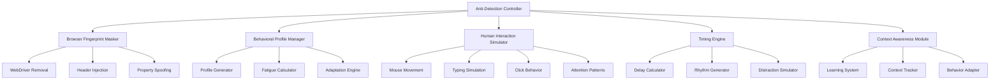

# Design Document

## Overview

The Instagram Anti-Detection System is designed to create an undetectable automation framework that simulates authentic human behavior patterns. The system employs multiple layers of deception including browser fingerprint masking, behavioral simulation, timing variability, and context-aware adaptation to avoid detection by Instagram's sophisticated bot detection algorithms.

## Architecture

### Core Components



### System Layers

1. **Detection Layer**: Browser fingerprint masking and automation trace removal
2. **Behavioral Layer**: Human-like interaction patterns and timing
3. **Adaptation Layer**: Context-aware behavior modification and learning
4. **Integration Layer**: Coordination between all anti-detection mechanisms

## Components and Interfaces

### 1. Human Interaction Enhancer

**Purpose**: Enhance existing Playwright interactions with realistic human behavior patterns.

**Key Methods**:
- `enhance_click_behavior()`: Add realistic mouse movements and positioning to existing clicks
- `enhance_typing_behavior()`: Improve text input with errors, corrections, and natural rhythm
- `add_attention_patterns()`: Implement scanning and hesitation before element interactions
- `preserve_upload_logic()`: Ensure human behavior doesn't break existing functionality

**Configuration**:
```python
class HumanBehaviorConfig:
    timing_ranges: Dict[str, Range]  # Dynamic delay ranges for different actions
    error_rates: Dict[str, float]    # Realistic mistake frequencies
    fatigue_curves: Dict[str, Callable]  # Session-based performance degradation
    fallback_enabled: bool           # Enable graceful degradation
```

### 2. Dynamic Behavior Manager

**Purpose**: Generate dynamic behavioral variations without fixed profiles to avoid predictable patterns.

**Variation Strategies**:
- **Timing Randomization**: Dynamic delay ranges that change per session
- **Speed Fluctuation**: Variable typing and interaction speeds within human ranges  
- **Error Variation**: Randomized mistake patterns without fixed rates
- **Pause Dynamics**: Unpredictable thinking and decision delays

**Key Methods**:
- `generate_session_variations()`: Create random behavioral parameters for current session
- `calculate_fatigue()`: Determine current fatigue level affecting all timings
- `get_dynamic_delays()`: Return randomized timing variations for current action
- `vary_interaction_speed()`: Adjust interaction speed dynamically within human ranges

### 3. Human Interaction Simulator

**Purpose**: Simulate authentic human interaction patterns for all user actions.

#### Mouse Movement Component
- **Curved Trajectories**: Bezier curves with control points and natural deviations
- **Variable Speed**: Acceleration/deceleration patterns matching human movement
- **Precision Variation**: Profile-based accuracy with realistic overshoot/correction
- **Attention Simulation**: Looking around before focusing on target elements

#### Typing Simulation Component
- **Error Generation**: Realistic typos based on keyboard layout proximity
- **Correction Patterns**: Human-like error recognition and backspace behavior
- **Speed Variation**: Character-based timing with burst typing and thinking pauses
- **Fatigue Effects**: Increasing errors and slower speed over time

#### Click Behavior Component
- **Hover Patterns**: Realistic hover duration before clicking
- **Click Positioning**: Off-center clicks within element bounds
- **Double-takes**: Occasional mouse movement away and back to element
- **Pressure Simulation**: Variable click duration and force

### 4. Timing Engine

**Purpose**: Generate sophisticated timing patterns that avoid detection signatures.

**Key Algorithms**:
- **Time-of-Day Multipliers**: Slower in morning/night, faster during day
- **Fatigue Curves**: Exponential increase in delays over session duration
- **Distraction Simulation**: Random long pauses (5-15 seconds) with 10% probability
- **Rhythm Variation**: Non-uniform distributions preventing pattern detection

**Timing Categories**:
```python
class TimingPatterns:
    thinking_pauses: Range[0.8, 3.5]  # Decision-making delays
    workflow_delays: Range[1.0, 3.0]  # Between major actions
    micro_delays: Range[0.02, 0.08]   # Character typing
    attention_shifts: Range[0.3, 0.8]  # Focus changes
```

### 5. Upload Logic Preservation Engine

**Purpose**: Ensure human behavior enhancements don't break existing upload functionality.

**Preservation Mechanisms**:
- **Fallback Systems**: Graceful degradation when human simulation fails
- **Timing Validation**: Ensure delays don't cause critical timeouts
- **Logic Preservation**: Maintain all existing success paths and error handling
- **Performance Monitoring**: Track upload success rates with human behavior enabled

**Safety Features**:
- Disable human behavior on critical upload steps if needed
- Maintain existing selector logic and element detection
- Preserve all error handling and retry mechanisms
- Monitor and alert on upload success rate degradation

## Data Models

### Behavioral Profile Model
```python
@dataclass
class BehaviorProfile:
    profile_type: ProfileType
    typing_speed: float  # characters per second
    error_rate: float    # probability of mistakes
    pause_frequency: float  # thinking pause probability
    mouse_precision: float  # movement accuracy
    fatigue_resistance: float  # fatigue accumulation rate
```

### Interaction Context Model
```python
@dataclass
class InteractionContext:
    element_type: str
    action_type: str
    previous_attempts: int
    success_history: List[bool]
    time_since_last_action: float
    current_fatigue_level: float
```

### Timing Configuration Model
```python
@dataclass
class TimingConfig:
    base_delays: Dict[str, Range]
    profile_multipliers: Dict[ProfileType, float]
    fatigue_curves: Dict[str, Callable]
    time_of_day_factors: Dict[int, float]
```

## Error Handling

### Graceful Degradation Strategy
1. **Primary**: Full behavioral simulation with all anti-detection features
2. **Secondary**: Reduced behavioral complexity with core fingerprint masking
3. **Fallback**: Basic timing delays with minimal fingerprint protection
4. **Emergency**: Direct automation with logging for analysis

### Error Recovery Patterns
- **Timeout Handling**: Reduce complexity and retry with simpler behavior
- **Element Not Found**: Increase exploration time and retry with broader selectors
- **Network Issues**: Simulate human confusion with longer pauses before retry
- **Captcha Detection**: Trigger human-like solving patterns or graceful exit

## Testing Strategy

### Behavioral Validation Tests
1. **Timing Distribution Analysis**: Verify non-uniform timing patterns
2. **Error Pattern Validation**: Confirm realistic mistake frequencies
3. **Profile Consistency Tests**: Ensure behavior matches selected profile
4. **Fatigue Progression Tests**: Validate gradual performance degradation

### Anti-Detection Verification
1. **Fingerprint Scanning**: Use detection tools to verify masking effectiveness
2. **Pattern Analysis**: Statistical analysis of action timing and sequences
3. **Behavioral Turing Tests**: Compare automation vs. human interaction logs
4. **Instagram Compatibility**: Monitor success rates and account safety

### Integration Testing
1. **End-to-End Workflows**: Complete upload processes with full behavioral simulation
2. **Multi-Account Testing**: Verify different profiles across multiple accounts
3. **Long-Session Testing**: Extended automation sessions with fatigue simulation
4. **Error Recovery Testing**: Graceful handling of various failure scenarios

## Performance Considerations

### Optimization Strategies
- **Lazy Loading**: Initialize behavioral components only when needed
- **Caching**: Store calculated timing patterns and behavioral decisions
- **Adaptive Complexity**: Scale behavioral detail based on system resources
- **Parallel Processing**: Run behavioral calculations alongside main automation

### Resource Management
- **Memory Usage**: Limit behavioral history storage with rolling windows
- **CPU Impact**: Balance behavioral realism with processing overhead
- **Network Efficiency**: Minimize additional requests for behavioral data
- **Storage Requirements**: Compress behavioral logs and learning data

## Security and Privacy

### Data Protection
- **Behavioral Anonymization**: Remove identifying patterns from stored behavior data
- **Profile Isolation**: Prevent cross-contamination between different user profiles
- **Secure Storage**: Encrypt behavioral learning data and timing patterns
- **Audit Trails**: Log behavioral decisions for debugging without exposing sensitive data

### Detection Resistance
- **Pattern Obfuscation**: Continuously vary behavioral signatures
- **Signature Rotation**: Regular updates to fingerprint masking techniques
- **Adaptive Countermeasures**: Respond to new detection methods automatically
- **Stealth Monitoring**: Track detection attempts without revealing defensive measures