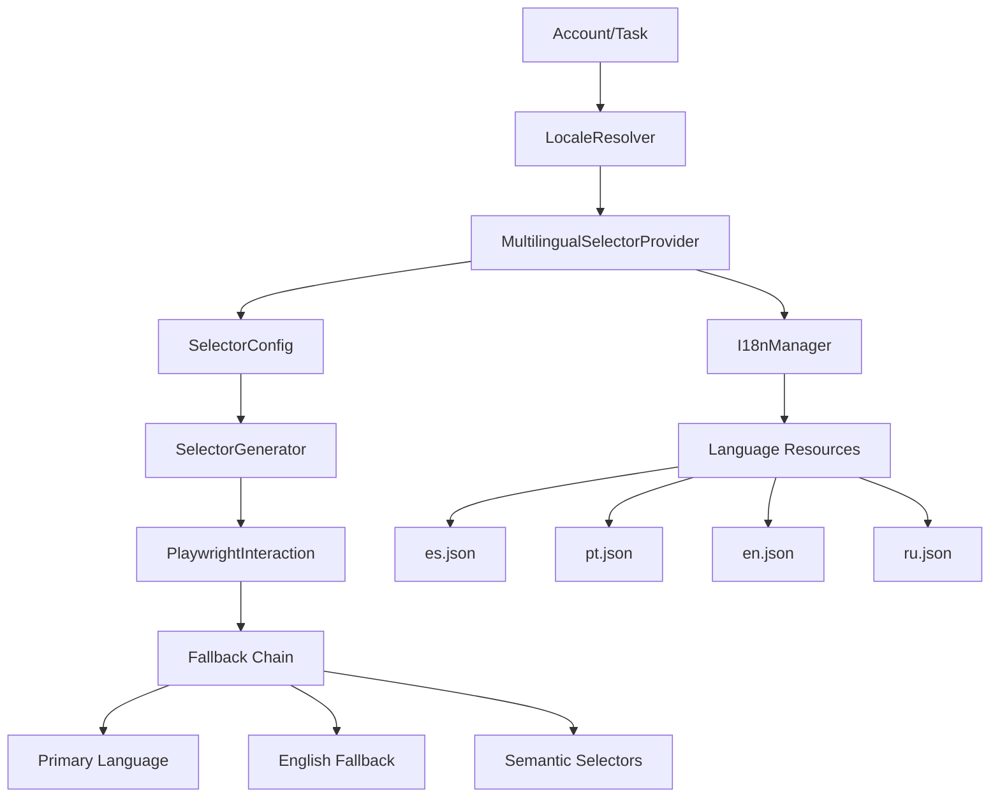

# Design Document

## Overview

This design implements comprehensive multilingual selector support for Spanish and Portuguese locales in the Instagram automation system. The solution centralizes all text-based selectors, integrates with the existing i18n system, and provides robust fallback mechanisms to ensure reliable automation across different language interfaces.

The design follows a layered architecture approach where the existing `SelectorConfig` class is enhanced with dynamic selector generation capabilities, while maintaining backward compatibility with the current implementation.

## Architecture

### High-Level Architecture



### Component Interaction Flow

1. **Locale Resolution**: Account locale is resolved to language code (es, pt, en, ru)
2. **Selector Generation**: Dynamic selectors are generated based on locale priority
3. **Fallback Chain**: If primary language fails, system tries English, then semantic selectors
4. **Logging**: All selector attempts and results are logged for monitoring

## Components and Interfaces

### 1. Enhanced SelectorConfig Class

```python
class InstagramSelectors:
    """Enhanced centralized selector configuration with multilingual support"""
    
    # Static semantic selectors (language-independent)
    SEMANTIC_SELECTORS = {
        'upload_button': [
            'svg[aria-label*="New post"]',
            'svg[aria-label*="Create"]',
            'button[data-testid="new-post-button"]',
            'a[href="/create/select/"]'
        ],
        'next_button': [
            'button[type="submit"]',
            'button[data-testid="next-button"]',
            '[role="button"][tabindex="0"]'
        ]
    }
    
    # Text-based selector templates (i18n keys)
    TEXT_SELECTOR_TEMPLATES = {
        'upload_button': [
            'button:has-text("{upload.button}")',
            'div[role="button"]:has-text("{upload.button}")',
            'a:has(span:has-text("{upload.button}"))'
        ],
        'next_button': [
            'button:has-text("{button.next}")',
            'div[role="button"]:has-text("{button.next}")'
        ],
        'share_button': [
            'button:has-text("{button.share}")',
            'div[role="button"]:has-text("{button.share}")'
        ]
    }
```

### 2. MultilingualSelectorProvider

```python
class MultilingualSelectorProvider:
    """Provides locale-aware selectors with fallback support"""
    
    def __init__(self, i18n_manager: LanguageManager):
        self.i18n = i18n_manager
        self.selector_cache = {}
        
    def get_selectors(self, selector_type: str, locale: str) -> List[str]:
        """Generate selectors for given type and locale with fallback chain"""
        
    def _generate_text_selectors(self, templates: List[str], locale: str) -> List[str]:
        """Generate text-based selectors using i18n translations"""
        
    def _get_fallback_chain(self, locale: str) -> List[str]:
        """Get language fallback chain: locale -> en -> semantic"""
```

### 3. LocaleResolver

```python
class LocaleResolver:
    """Resolves account locale to language codes"""
    
    @staticmethod
    def resolve_account_locale(account) -> str:
        """Resolve account locale from various sources"""
        
    @staticmethod
    def get_language_priority(locale: str) -> List[str]:
        """Get language priority list for fallback chain"""
```

### 4. Enhanced I18n Resources

The existing i18n system will be extended with comprehensive selector text mappings:

**es.json (Enhanced)**
```json
{
  "login.submit": "Iniciar sesión",
  "button.next": "Siguiente",
  "button.share": "Compartir",
  "button.create": "Crear",
  "upload.button": "Crear",
  "upload.select_files": "Seleccionar archivos",
  "upload.select_from_computer": "Seleccionar desde el ordenador",
  "dialog.not_now": "Ahora no",
  "dialog.ok": "Aceptar",
  "dialog.done": "Listo",
  "caption.placeholder": "Escribe un pie de foto",
  "location.placeholder": "Agregar ubicación",
  "mentions.placeholder": "Agregar colaboradores"
}
```

**pt.json (Enhanced)**
```json
{
  "login.submit": "Entrar",
  "button.next": "Avançar", 
  "button.share": "Compartilhar",
  "button.create": "Criar",
  "upload.button": "Criar",
  "upload.select_files": "Selecionar arquivos",
  "upload.select_from_computer": "Selecionar do computador",
  "dialog.not_now": "Agora não",
  "dialog.ok": "Aceitar",
  "dialog.done": "Concluído",
  "caption.placeholder": "Escreva uma legenda",
  "location.placeholder": "Adicionar localização",
  "mentions.placeholder": "Adicionar colaboradores"
}
```

## Data Models

### SelectorResult

```python
@dataclass
class SelectorResult:
    """Result of selector attempt with metadata"""
    success: bool
    selector_used: str
    language_used: str
    fallback_level: int  # 0=primary, 1=english, 2=semantic
    element_found: bool
    execution_time_ms: float
    error_message: Optional[str] = None
```

### SelectorMetrics

```python
@dataclass
class SelectorMetrics:
    """Metrics for selector performance monitoring"""
    selector_type: str
    language: str
    success_rate: float
    avg_execution_time: float
    fallback_usage: Dict[int, int]  # fallback_level -> count
    last_updated: datetime
```

## Error Handling

### Fallback Strategy

1. **Primary Language**: Try selectors with account's configured language
2. **English Fallback**: If primary fails, try English variants
3. **Semantic Fallback**: If text-based selectors fail, use aria-labels and roles
4. **Legacy Fallback**: As last resort, try existing hardcoded selectors

### Error Recovery

```python
class SelectorErrorHandler:
    """Handles selector failures and implements recovery strategies"""
    
    def handle_selector_failure(self, selector_type: str, locale: str, error: Exception) -> List[str]:
        """Return alternative selectors when primary selection fails"""
        
    def log_selector_failure(self, result: SelectorResult):
        """Log selector failures for monitoring and improvement"""
```

## Testing Strategy

### Unit Tests

1. **SelectorGeneration Tests**: Verify correct selector generation for each language
2. **I18n Integration Tests**: Test integration with LanguageManager
3. **Fallback Chain Tests**: Verify fallback logic works correctly
4. **Cache Tests**: Test selector caching mechanisms

### Integration Tests

1. **End-to-End Language Tests**: Test complete workflows in Spanish/Portuguese
2. **Mixed Language Tests**: Test scenarios with inconsistent language elements
3. **Fallback Integration Tests**: Test fallback behavior in real browser scenarios
4. **Performance Tests**: Measure selector resolution performance

### Test Data

```python
# Test scenarios for each language
TEST_SCENARIOS = {
    'es': {
        'login': {'username': 'test_es@example.com', 'expected_elements': ['Iniciar sesión']},
        'upload': {'expected_elements': ['Crear', 'Seleccionar archivos']},
        'share': {'expected_elements': ['Compartir', 'Siguiente']}
    },
    'pt': {
        'login': {'username': 'test_pt@example.com', 'expected_elements': ['Entrar']},
        'upload': {'expected_elements': ['Criar', 'Selecionar arquivos']},
        'share': {'expected_elements': ['Compartilhar', 'Avançar']}
    }
}
```

## Implementation Phases

### Phase 1: Core Infrastructure
- Enhance SelectorConfig with template support
- Implement MultilingualSelectorProvider
- Extend i18n resources with selector texts
- Add LocaleResolver functionality

### Phase 2: Integration
- Update existing selector usage to use new provider
- Implement fallback chain logic
- Add comprehensive logging and metrics
- Update async_impl modules

### Phase 3: Testing & Optimization
- Implement comprehensive test suite
- Add performance monitoring
- Optimize selector caching
- Fine-tune fallback strategies

### Phase 4: Migration & Cleanup
- Remove hardcoded text selectors from individual files
- Migrate all selector usage to centralized system
- Add documentation and developer guidelines
- Implement monitoring dashboards

## Performance Considerations

### Caching Strategy

- **Selector Cache**: Cache generated selectors by (type, locale) key
- **I18n Cache**: Leverage existing LanguageManager caching
- **Result Cache**: Cache successful selector results for session duration

### Optimization Techniques

- **Lazy Loading**: Generate selectors only when needed
- **Batch Generation**: Generate related selectors together
- **Priority Ordering**: Order selectors by success probability
- **Early Exit**: Stop trying selectors once successful match found

## Monitoring and Observability

### Metrics Collection

```python
class SelectorMetricsCollector:
    """Collects and aggregates selector performance metrics"""
    
    def record_selector_attempt(self, result: SelectorResult):
        """Record individual selector attempt"""
        
    def get_language_success_rates(self) -> Dict[str, float]:
        """Get success rates by language"""
        
    def get_fallback_usage_stats(self) -> Dict[str, Dict[int, int]]:
        """Get fallback usage statistics"""
```

### Logging Strategy

- **Structured Logging**: Use consistent log format for selector events
- **Language Tagging**: Tag all logs with language context
- **Performance Logging**: Log selector resolution times
- **Failure Analysis**: Detailed logging of selector failures for debugging

This design ensures comprehensive multilingual support while maintaining system performance and reliability through robust fallback mechanisms and thorough monitoring.