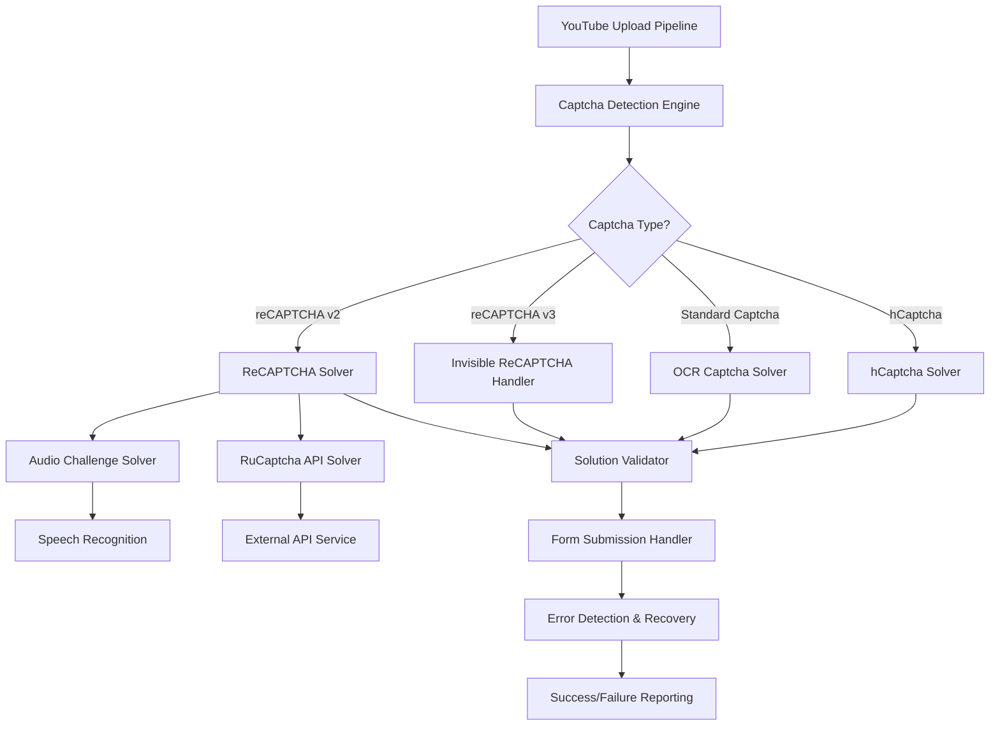
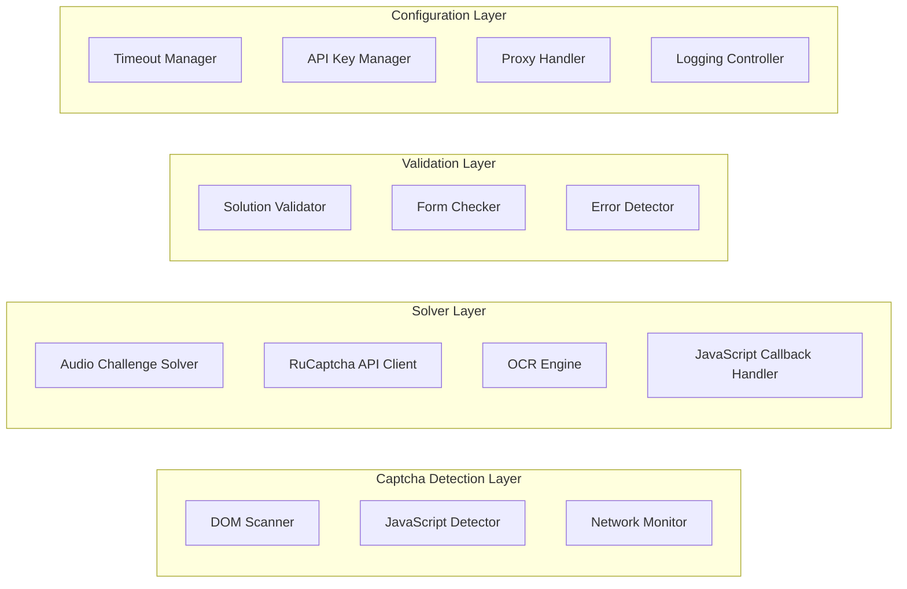

# YouTube Captcha Enhancement Design

## Overview

Дизайн улучшенной системы решения капчи для YouTube пайплайна, которая обеспечивает надежное обнаружение, решение различных типов капчи и предотвращение блокировок аккаунтов через многоуровневый подход с fallback механизмами.

## Architecture

### High-Level Architecture



### Component Architecture



## Components and Interfaces

### 1. Enhanced Captcha Detection Engine

**Класс: `EnhancedCaptchaDetector`**

```python
class EnhancedCaptchaDetector:
    async def detect_captcha_type(self, page: Page) -> CaptchaType
    async def wait_for_captcha_appearance(self, page: Page, timeout: int) -> bool
    async def extract_captcha_parameters(self, page: Page) -> CaptchaParameters
    async def is_captcha_solved(self, page: Page) -> bool
```

**Функциональность:**
- Обнаружение reCAPTCHA v2/v3, hCaptcha, стандартных капч
- JavaScript-based детекция через `___grecaptcha_cfg`
- DOM-based поиск по селекторам и атрибутам
- Мониторинг сетевых запросов для invisible reCAPTCHA

### 2. Multi-Method ReCAPTCHA Solver

**Класс: `MultiMethodReCaptchaSolver`**

```python
class MultiMethodReCaptchaSolver:
    async def solve_recaptcha(self, page: Page, params: CaptchaParameters) -> SolutionResult
    async def try_audio_challenge(self, page: Page) -> Optional[str]
    async def try_api_solution(self, page: Page, site_key: str) -> Optional[str]
    async def submit_solution(self, page: Page, solution: str) -> bool
```

**Методы решения (по приоритету):**
1. **Audio Challenge** - бесплатный, надежный для v2
2. **RuCaptcha API** - платный, высокая успешность
3. **JavaScript Callback** - для invisible reCAPTCHA
4. **Manual Intervention** - последний резерв

### 3. Improved Audio Challenge Solver

**Класс: `ImprovedAudioSolver`**

```python
class ImprovedAudioSolver:
    async def solve_audio_challenge(self, page: Page) -> Optional[str]
    async def download_audio_file(self, audio_url: str) -> str
    async def process_audio_with_speech_recognition(self, audio_path: str) -> str
    async def enhance_audio_quality(self, audio_path: str) -> str
```

**Улучшения:**
- Предварительная обработка аудио (шумоподавление, нормализация)
- Поддержка множественных попыток с разными настройками
- Кэширование успешных аудио-паттернов
- Fallback на разные языки распознавания

### 4. RuCaptcha API Client

**Класс: `RuCaptchaApiClient`**

```python
class RuCaptchaApiClient:
    async def create_task(self, site_key: str, page_url: str, proxy: Optional[Dict]) -> str
    async def get_task_result(self, task_id: str) -> Optional[str]
    async def handle_proxy_task(self, task_data: Dict) -> str
    async def handle_proxyless_task(self, task_data: Dict) -> str
```

**Особенности:**
- Автоматический выбор proxy/proxyless режима
- Retry логика с экспоненциальным backoff
- Мониторинг баланса API
- Поддержка разных типов задач (RecaptchaV2Task, RecaptchaV3Task)

### 5. Solution Submission Handler

**Класс: `SolutionSubmissionHandler`**

```python
class SolutionSubmissionHandler:
    async def validate_solution_format(self, solution: str) -> bool
    async def inject_solution_token(self, page: Page, solution: str) -> bool
    async def trigger_callback_functions(self, page: Page, solution: str) -> bool
    async def submit_form_safely(self, page: Page) -> bool
    async def detect_submission_errors(self, page: Page) -> Optional[str]
```

**Критические улучшения:**
- Обязательная 3-секундная задержка перед отправкой
- Проверка корректности формы перед submit
- Детекция 400 ошибок и других проблем
- Graceful handling неудачных отправок

## Data Models

### CaptchaParameters

```python
@dataclass
class CaptchaParameters:
    captcha_type: CaptchaType
    site_key: Optional[str]
    page_url: str
    iframe_src: Optional[str]
    callback_function: Optional[str]
    invisible: bool = False
```

### SolutionResult

```python
@dataclass
class SolutionResult:
    success: bool
    solution: Optional[str]
    method_used: SolutionMethod
    processing_time: float
    error_message: Optional[str]
    retry_recommended: bool = False
```

### CaptchaConfig

```python
@dataclass
class CaptchaConfig:
    audio_timeout: int = 30
    api_timeout: int = 120
    max_retries: int = 3
    rucaptcha_api_key: Optional[str] = None
    enable_audio_challenge: bool = True
    enable_api_fallback: bool = True
    submission_delay: int = 3
```

## Error Handling

### Error Categories

1. **Detection Errors**
   - Captcha not found
   - Unknown captcha type
   - Site key extraction failure

2. **Solution Errors**
   - Audio download failure
   - Speech recognition failure
   - API service unavailable
   - Invalid solution format

3. **Submission Errors**
   - 400 Bad Request
   - Form validation failure
   - Network timeout
   - Bot detection

### Error Recovery Strategy

```python
class CaptchaErrorHandler:
    async def handle_detection_error(self, error: DetectionError) -> RecoveryAction
    async def handle_solution_error(self, error: SolutionError) -> RecoveryAction
    async def handle_submission_error(self, error: SubmissionError) -> RecoveryAction
    async def should_retry(self, error: CaptchaError, attempt: int) -> bool
```

**Recovery Actions:**
- Retry with different method
- Switch to manual intervention
- Mark account for review
- Abort current session

## Testing Strategy

### Unit Tests

1. **CaptchaDetector Tests**
   - Mock pages with different captcha types
   - Test detection accuracy and timing
   - Validate parameter extraction

2. **Solver Tests**
   - Mock audio files with known content
   - Test API client with mock responses
   - Validate solution format and submission

3. **Error Handling Tests**
   - Simulate various error conditions
   - Test recovery mechanisms
   - Validate retry logic

### Integration Tests

1. **End-to-End Captcha Flow**
   - Real captcha solving on test pages
   - Performance benchmarking
   - Success rate measurement

2. **Browser Compatibility**
   - Test with different browser profiles
   - Validate anti-detection measures
   - Check proxy compatibility

### Performance Tests

1. **Latency Measurement**
   - Detection time
   - Solution time
   - Submission time

2. **Success Rate Analysis**
   - Method-specific success rates
   - Error pattern analysis
   - Optimization recommendations

## Security Considerations

### Anti-Detection Measures

1. **Browser Fingerprinting**
   - Realistic user agent strings
   - Consistent viewport and screen resolution
   - Natural mouse movement patterns

2. **Timing Patterns**
   - Human-like delays between actions
   - Randomized processing times
   - Realistic audio processing duration

3. **Network Behavior**
   - Proper proxy rotation
   - Consistent IP geolocation
   - Natural request patterns

### Data Protection

1. **API Key Security**
   - Environment variable storage
   - Encrypted configuration files
   - Access logging and monitoring

2. **Temporary File Handling**
   - Secure audio file storage
   - Automatic cleanup procedures
   - No sensitive data persistence

## Performance Optimization

### Caching Strategy

1. **Site Key Caching**
   - Cache extracted site keys per domain
   - Reduce detection overhead
   - Improve response times

2. **Solution Caching**
   - Cache successful audio patterns
   - Reuse similar challenge solutions
   - Reduce API calls

### Resource Management

1. **Memory Optimization**
   - Efficient audio file handling
   - Cleanup temporary resources
   - Monitor memory usage

2. **Network Optimization**
   - Connection pooling for API calls
   - Parallel processing where possible
   - Bandwidth usage monitoring

## Monitoring and Logging

### Metrics Collection

1. **Success Metrics**
   - Overall success rate
   - Method-specific success rates
   - Processing time statistics

2. **Error Metrics**
   - Error frequency by type
   - Recovery success rates
   - Account blocking incidents

### Logging Strategy

1. **Structured Logging**
   - JSON format for easy parsing
   - Consistent log levels and categories
   - Correlation IDs for tracking

2. **Log Retention**
   - Configurable retention periods
   - Log rotation and archival
   - Privacy-compliant data handling

## Configuration Management

### Environment Variables

```bash
# RuCaptcha API Configuration
RUCAPTCHA_API_KEY=your_api_key_here
RUCAPTCHA_TIMEOUT=120

# Audio Challenge Configuration
AUDIO_CHALLENGE_ENABLED=true
AUDIO_TIMEOUT=30
SPEECH_RECOGNITION_LANGUAGE=en-US

# Submission Configuration
SUBMISSION_DELAY=3
MAX_RETRIES=3
RETRY_DELAY=5

# Logging Configuration
LOG_LEVEL=INFO
LOG_CAPTCHA_DETAILS=true
```

### Runtime Configuration

```python
captcha_config = CaptchaConfig(
    audio_timeout=30,
    api_timeout=120,
    max_retries=3,
    rucaptcha_api_key=os.getenv('RUCAPTCHA_API_KEY'),
    enable_audio_challenge=True,
    enable_api_fallback=True,
    submission_delay=3
)
```